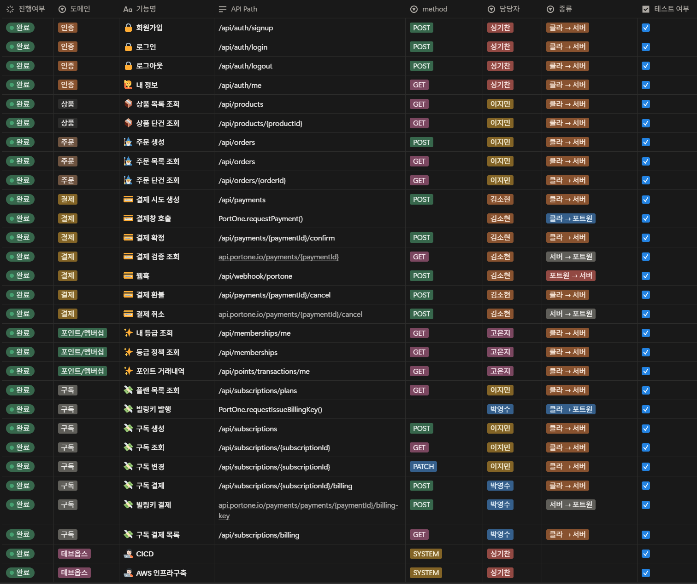
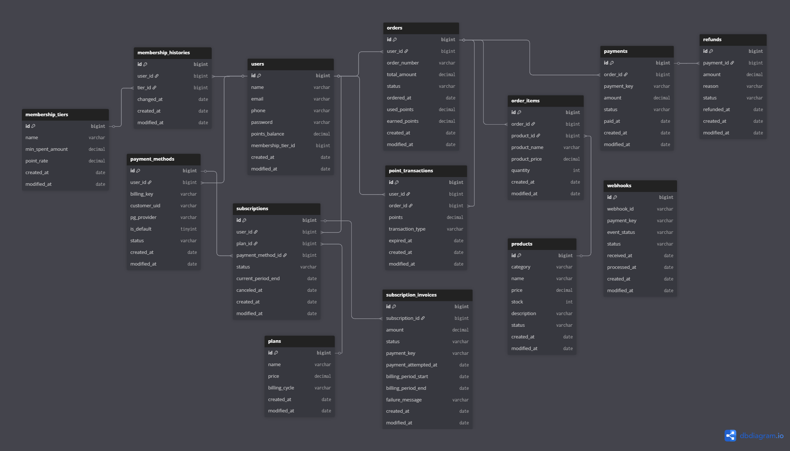
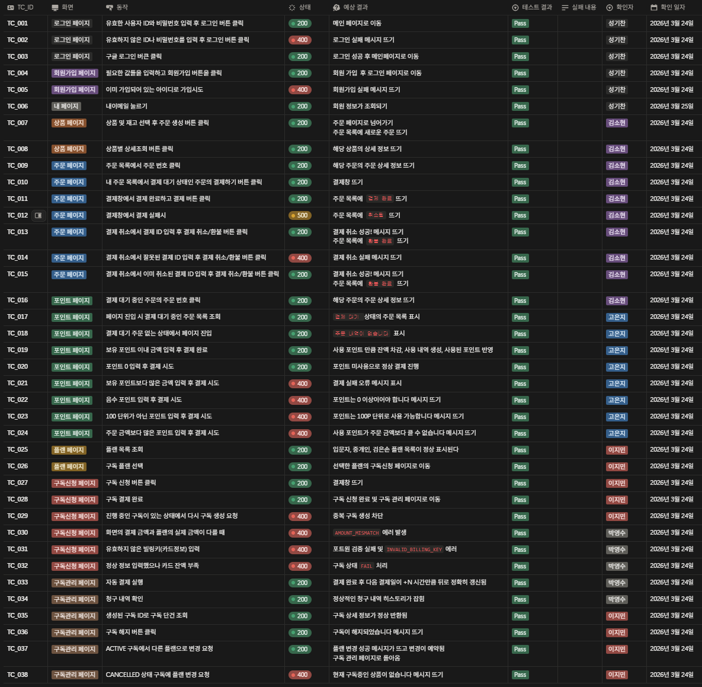

<div align="center">
  <br />
  <h1 style="border-bottom: none; font-size: 3.5em; background: linear-gradient(to right, #b19cd9, #3b0a45, #b19cd9); -webkit-background-clip: text; -webkit-text-fill-color: transparent;">
    7전8기의 암시장
  </h1>
  <p style="color: #8b949e; font-size: 1.2em; letter-spacing: 2px;">
    <b>THE RELENTLESS BLACK MARKET</b>
  </p>
  <hr style="background: linear-gradient(to right, transparent, #30363d, transparent); height: 1px; border: none;" />
  <br />
</div>

<p align="center">
  
  
  
  <br>
  
  
  
  <br>
  
  
  
</p>

---

## 📌 프로젝트 소개

**7전8기 암시장**은 PortOne(KG이니시스)을 활용한 **일반·정기 결제 시스템**과 고객 충성도를 극대화하는 **멤버십 기반 이커머스 솔루션**입니다.  
단순한 결제 처리를 넘어, **결제 검증 및 보상 트랜잭션**을 통해 금융 수준의 데이터 무결성을 지향합니다.

---

#### 💳 결제 및 구독 (Payment & Subscription)
* **결제 통합:** PortOne + KG이니시스 PG 연동을 통한 신용카드 일반 결제 구현
* **정기 결제:** 빌링키 기반의 자동 결제 수단 등록 및 구독 서비스 제공
* **결제 검증:** 웹훅(Webhook) 및 PortOne API를 통한 결제 금액 위변조 방지 및 멱등성 보장

#### 💎 멤버십 및 포인트 (Loyalty Program)
* **자동 등급 관리:** 누적 결제액에 따른 실시간 멤버십 등급 갱신 시스템
* **스마트 포인트:** 등급별 차등 적립률 적용 및 결제 시 포인트 복합 사용 지원
* **신뢰 기반 환불:** 주문 취소 시 실시간 결제 취소, 포인트 회수 및 복구의 원자성 보장

#### 🛡️ 시스템 안정성 (Reliability)
* **재고 정합성:** 비관적 락(`Pessimistic Lock`)을 적용하여 고가용성 환경에서도 정확한 재고 관리
* **보상 트랜잭션:** 외부 API 장애 및 재고 부족 시 자동 취소 및 데이터 롤백 처리
* **인증 및 인가:** Spring Security 기반의 안전한 회원가입 및 주문 프로세스

---

## 👥 팀소개

| 이름  | 역할 | 담당                        |
|-----|----|---------------------------|
| 김소현 | 팀장 | 일반 결제 및 웹훅 API 개발 |
| 성기찬 | 팀원 | 인증 인가 API 개발 및 CI/CD 구축, AWS 인프라 구축 |
| 고은지 | 팀원 | 포인트 결제 API 개발 |
| 박영수 | 팀원 | 구독 결제 API 개발  |
| 이지민 | 팀원 | 상품, 주문 API 개발 |

<br>

### [📎프로젝트 노션 바로가기](https://www.notion.so/teamsparta/7-8-31e2dc3ef51480398ef6eff4980e2f2e)

---

## ⏲️ 개발기간
- 2026.03.16(월) ~ 2026.03.27(금)

---

## 🧩 Architecture

<p align="center">
  
</p>

---

## 🔧 Technologies & Tools

#### 🖥️ Backend Stack
<p align="left">
  
  
  
  
</p>

#### 💾 Data & Infrastructure
<p align="left">
  
  
  
  
</p>

#### 🧪 Quality & DevOps
<p align="left">
  
  
  
  
</p>

#### 🤝 Collaboration & Management
<p align="left">
  
  
  
  
  
</p>

---

## 🧠 적용 기술

#### ◻ **비관적 락**
> 재고 차감 시 발생할 수 있는 동시성 문제를 해결하기 위해 DB 수준의 배타적 잠금(`PESSIMISTIC_WRITE`)을 적용하여 데이터 정합성을 보장했습니다.

#### ◻ **보상 트랜잭션**
> 결제 과정 중 재고 부족이나 외부 API 장애 발생 시, 이미 처리된 외부 결제 취소 및 포인트 복구를 수행하여 서비스의 원자성(Atomicity)을 확보했습니다.

#### ◻ **Redis**
> 정기 결제 빌링키 관리나 빈번한 조회 데이터의 캐싱을 고려하여 In-memory 데이터 구조를 활용하고, 시스템의 응답 속도와 효율성을 높였습니다.

#### ◻ **JUnit5 & Mockito**
> 단위 테스트와 통합 테스트를 통해 비즈니스 로직의 신뢰성을 검증하고, 특히 다중 스레드 환경에서의 동시성 제어 로직을 코드로 증명했습니다.

#### ◻ **Spring Security & JWT**
> 인증 및 인가 처리를 필터 체인 기반으로 구성하여 API 접근 권한을 통제하고, Stateless한 JWT 인증 방식을 통해 서버 확장이 용이한 보안 구조를 설계했습니다.

#### ◻ **AWS (EC2, RDS)**
> 클라우드 인프라를 활용하여 안정적인 서버 운영 환경을 구축하고, 데이터베이스와 정적 리소스를 분리하여 관리 효율성을 극대화했습니다.

#### ◻ **Jira & Agile Methodology**
> Jira를 통해 백로그 관리 및 스프린트 단위의 태스크 배분을 수행하며, 프로젝트 진행 상황을 투명하게 관리하고 협업 효율을 높였습니다.

#### ◻ **Builder + Record**
> 객체 생성 시 Builder 패턴으로 가독성을 높이고, 불변 데이터 전달 객체에는 자바 17의 `record`를 활용하여 보일러플레이트 코드를 줄이고 안정성을 강화했습니다.

---

## 🚀 주요 기능

#### 🔐 인증 및 보안
- **다중 인증 체계:** Spring Security 기반의 일반 로그인 및 **Google OAuth 2.0** 소셜 로그인 연동
- **권한 제어:** JWT(JSON Web Token)를 활용한 Stateless 인증 및 권한 인가 로직 구현
- **계정 관리:** 비밀번호 단방향 해시 암호화 저장 및 마이페이지를 통한 개인정보 관리

#### 📦 상품 및 주문
- **상품 카탈로그:** 전체 상품 목록 조회 및 상세 정보(재고, 가격 등) 제공
- **재고 정합성 보장:** 상품 선택 및 주문 생성 시 **비관적 락(Pessimistic Lock)**을 적용하여 실시간 재고 동시성 제어
- **주문 상세 프로세스:** 주문 생성부터 결제 대기, 완료, 취소에 이르는 단계별 상태 관리 및 상세 내역 조회

#### 💳 결제 및 환불
- **통합 결제 연동:** PortOne(KG이니시스) API를 통한 실시간 카드 결제 및 결제 금액 위변조 검증
- **결제 취소:** 사용자의 단순 변심 또는 시스템 오류 시 실시간 결제 취소 및 전액 환불 처리
- **보상 트랜잭션:** 재고 부족이나 외부 API 장애 시 이미 처리된 로직을 되돌리는 **데이터 무결성** 확보

#### 💰 포인트 시스템
- **포인트 복합 결제:** 현금 결제와 포인트를 조합한 부분 차감 및 포인트 전액 결제 지원
- **등급별 차등 적립:** 결제 완료 시 멤버십 등급에 따른 포인트 자동 적립
- **실시간 복구:** 주문 취소 시 사용된 포인트의 즉각적인 복구 및 적립 포인트 회수

#### 🌑 멤버십 플랜
- **티어링 시스템:** 사용자의 목적에 따른 3가지 등급 플랜 운영
    - **입문자:** 일반 거래 및 기본 적립률 적용
    - **중개인:** 전문 거래를 위한 우대 적립률 제공
    - **검은손:** 암시장 최상위 권한 및 최대 적립 혜택 부여

#### 🔄 구독 관리
- **정기 결제:** 빌링키(Billing Key) 발급을 통한 주기적 자동 결제 시스템 구축
- **라이프사이클 관리:** 구독 신청, 플랜 변경(업그레이드/다운그레이드), 구독 해지 프로세스 구현
- **청구 내역 조회:** 구독 ID 기반의 월별 정기 결제 이력 및 다음 결제 예정일 확인

---

## 🖼 API 명세서

<p align="center">
  
</p>

보다 자세한 API 명세서는
[📎프로젝트 노션](https://www.notion.so/teamsparta/7-8-31e2dc3ef51480398ef6eff4980e2f2e) 에서 확인할 수 있습니다.

---

## 🗄 ERD Diagram

<p align="center">
  
</p>

---

## 🧪 TestCase

<p align="center">
  
</p>

---

## 📈 프로젝트 파일 구조

```text
src/main/java/com/paymentapp
├── 📂 api
│   ├── 📂 auth          # 인증/인가 (일반 로그인, OAuth 2.0)
│   ├── 📂 member        # 회원 정보 및 계정 관리
│   ├── 📂 membership    # 멤버십 등급 및 혜택 로직
│   ├── 📂 order         # 주문 생성 및 상세 정보 관리
│   ├── 📂 payment       # 결제 핵심 로직 (PaymentService, Controller)
│   │   ├── 📂 dto       # 결제 관련 데이터 전송 객체
│   │   ├── 📂 entity    # Payment, Refund 엔티티
│   │   ├── 📂 enums     # 결제 상태 및 환불 상태 정의
│   │   ├── 📂 exception # 결제 도메인 전용 예외 처리
│   │   ├── PaymentController    
│   │   ├── PaymentRepository 
│   │   ├── PaymentService
│   │   └── RefundRepository
│   │
│   ├── 📂 plan          # 멤버십 플랜 (입문자, 중개인, 검은손)
│   ├── 📂 point         # 포인트 적립 및 사용 시스템
│   ├── 📂 product       # 상품 정보 및 재고 관리
│   ├── 📂 subscription  # 정기 결제 및 구독 라이프사이클 관리
│   └── 📂 webhook       # PortOne 결제 결과 수신 및 검증
│ 
├── 📂 core              # 외부 API (PortOneClient) 및 공통 보안 설정
├── 📂 front             # 프론트엔드 연동 관련 리소스/컨트롤러
└── 📄 PaymentAppApplication.java
```

---

## 🚨 Trouble Shooting

👉 [결제 시스템의 재고 정합성 문제와 비관적 락(Pessimistic Lock) 적용](docs/troubleshooting/Pessimistic-Lock-for-Inventory-Consistency.md) <br>

---
